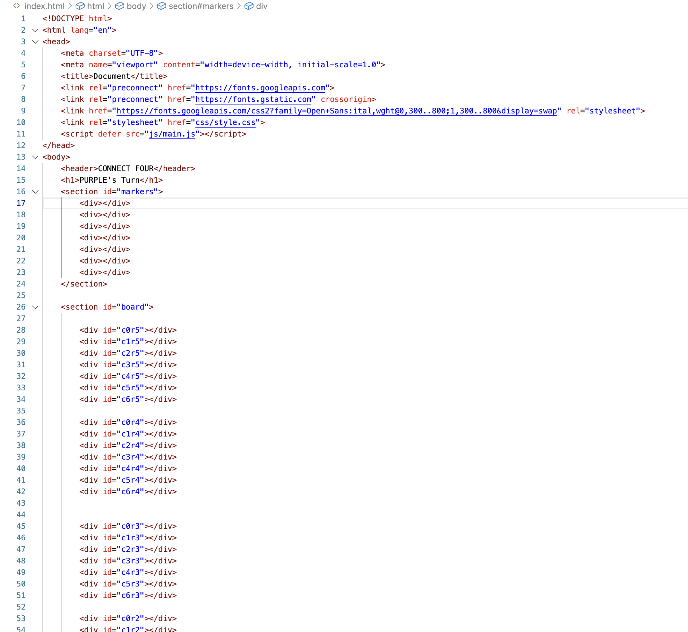
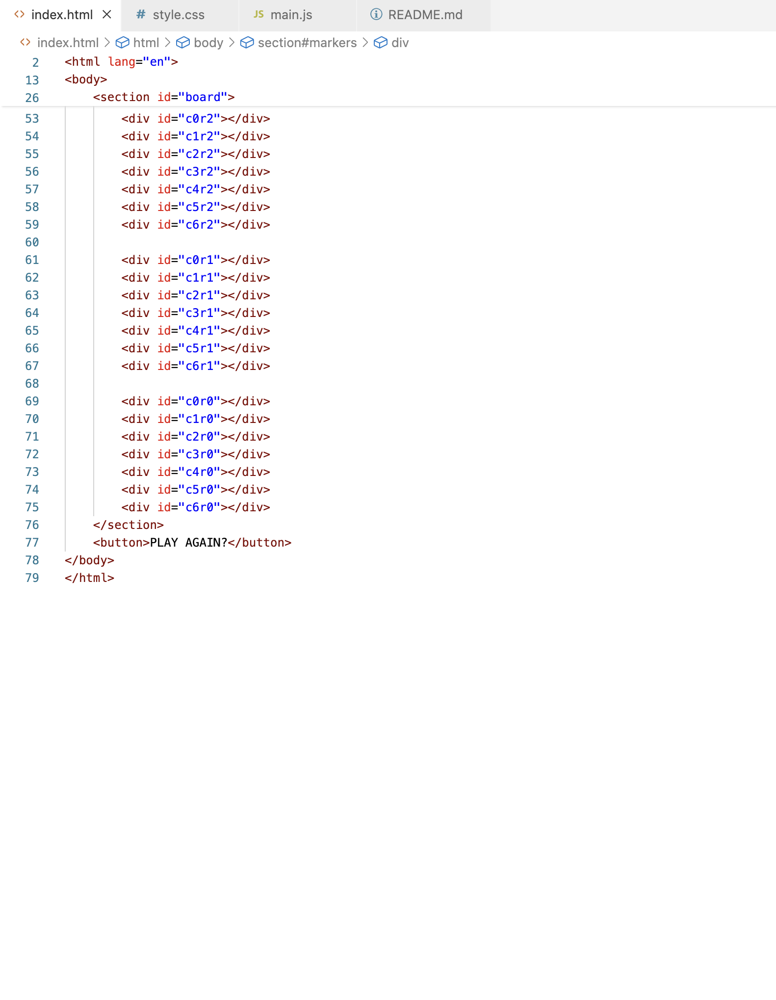
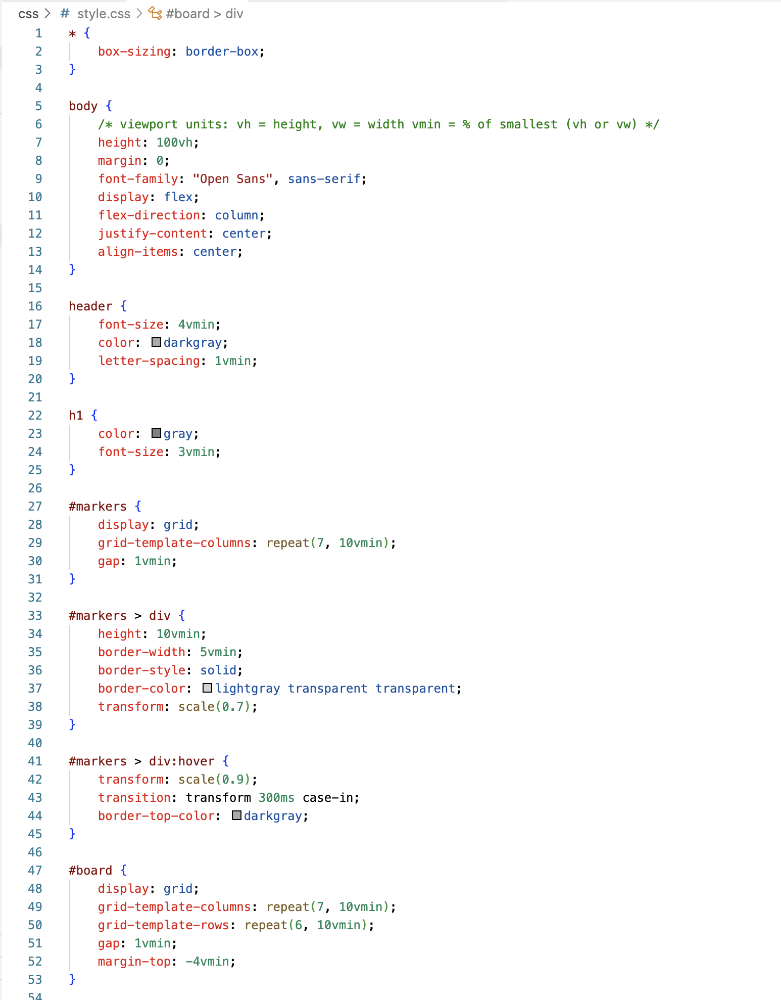
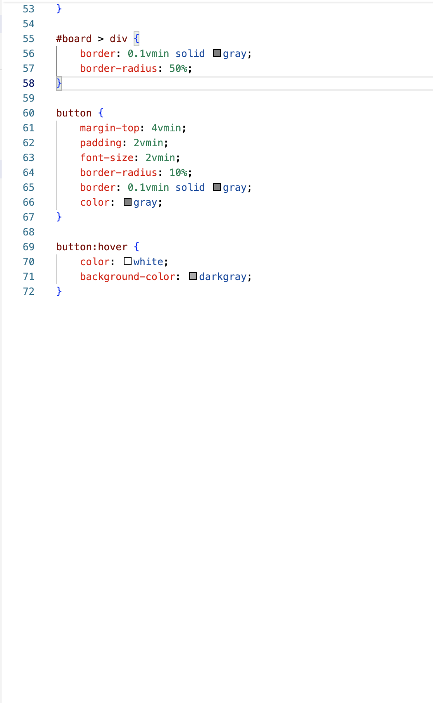
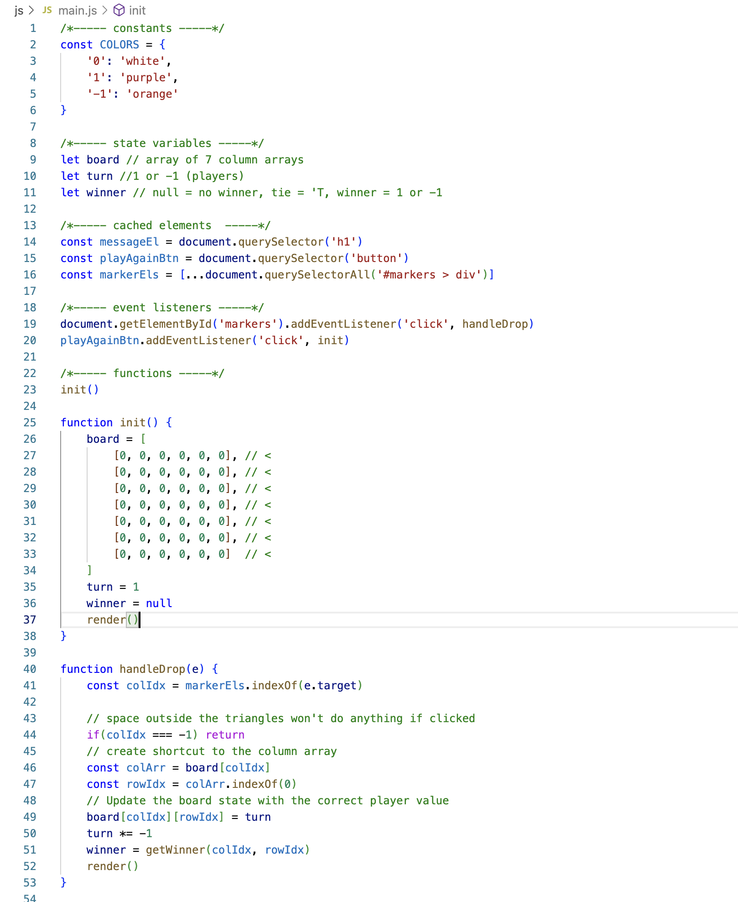
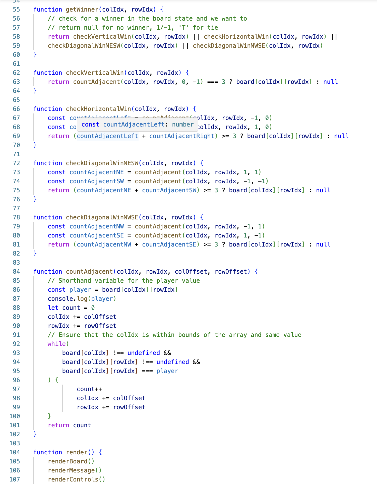
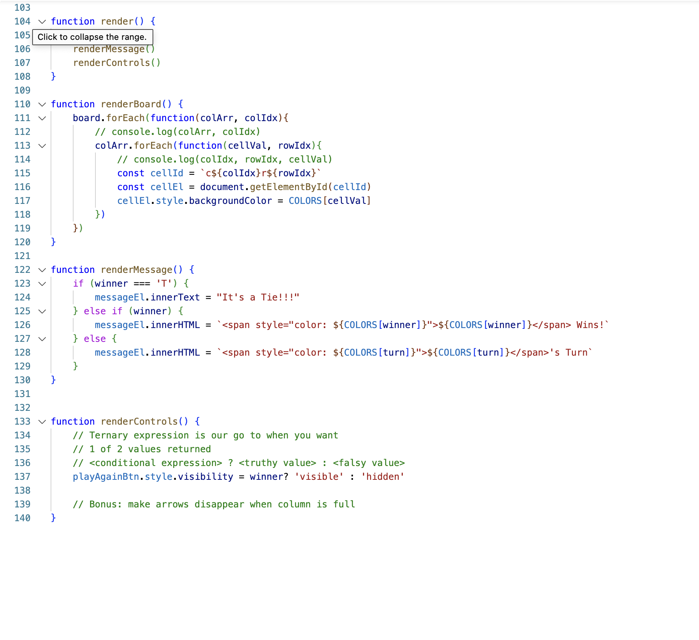
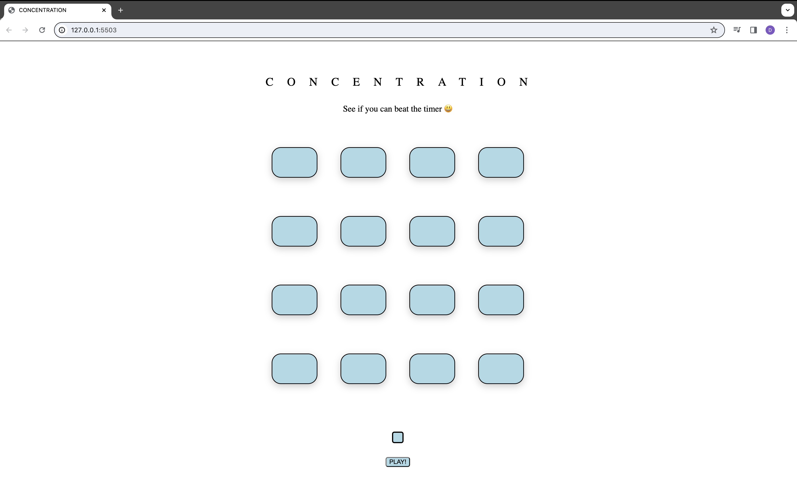
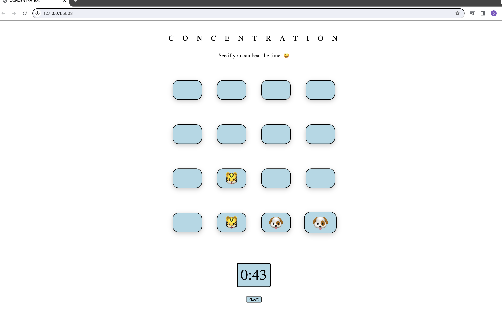

# <CONCENTRATION>

Concentration is a fun game to test your brain! Click on 2 cards at a time to see if the emojis on the cards are a match. If they are a match then they will remain open, but if they're not a match you have another chance to find the correct card! You just have to try to find all of them before the timer runs out! If you find all the matches before the timer runs out then you win. If the timer runs out and you didn't find all the matches then you lose! You can always play again by hitting the play button to start a new game!

# Screenshot

# Technologies Used

- JavaScript
- HTML
- CSS

# Getting Started

[Click to View Project Planning](your Trello url here)
[Click to Play Connect Four!](your deployment url here)

# Next Steps

- 3rd click before first and second unmatched cards have flipped over makes the first card remain open
- Fix the lose message to not come on even if timer is out and win has been determined 
- When there is a winner or a loser, the timer doesn't come back up when the play button is clicked